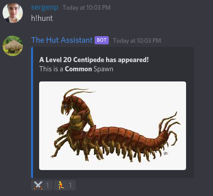
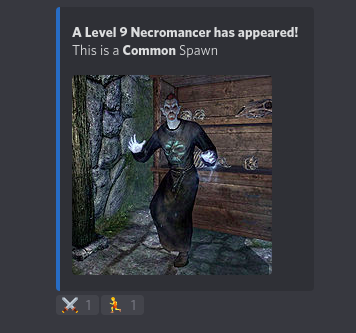
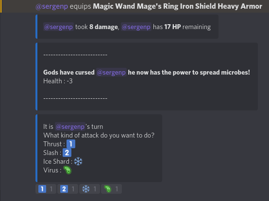
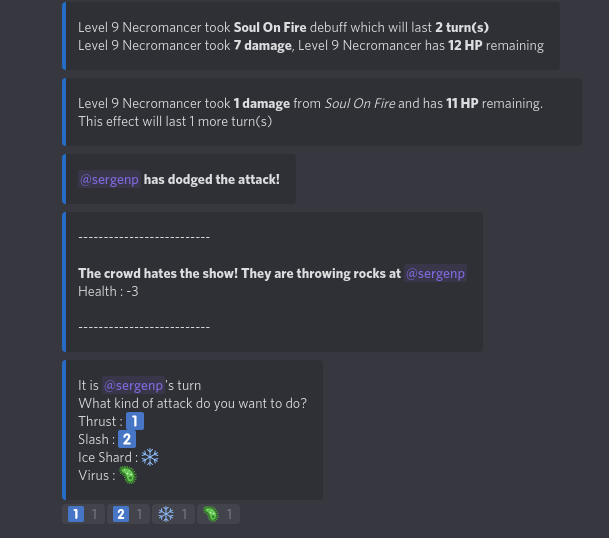
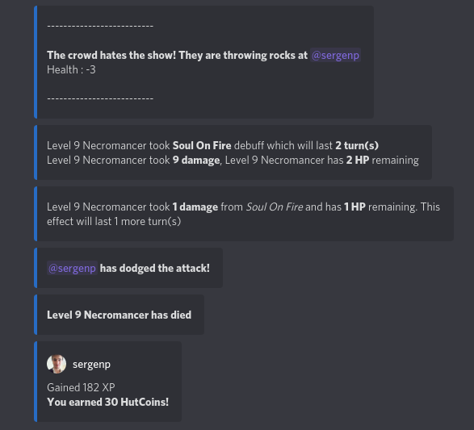

## The Hut Assistant

This README contains how to add the bot to your server, and explains its commands.

### How Do I add this bot to my server?

Simply click this following link:

https://discordapp.com/api/oauth2/authorize?client_id=598077927577616384&permissions=117824&scope=bot

to add the bot to your server

### What is this bot? What does it do?

Hut Assistant essentially has been created for a private server called "The Hut". It started as a multi-functional bot
that has some utility functionality, like searching videos on youtube based on given sentence or word. 
It has evolved into a RPG kind-of bot when I started working on a dueling system between players, which basically you challenge a discord member
to a duel, game starts, you have certain kind of moves available to you, you react to the message the bot has send to choose
from one of the moves and with some calculation happening in the background the other player takes damage.

I have recently added a tracking system that tracks the player's duel statistics.(How many won, how many lost, XP, Coins)
With that I have added NPCs to the dueling functionality. You can now, using the exact methods, duel with a computer controlled, player.

In future, I am planning to add more NPCs to the game.

#### Bot Commands

| Corona           |                                                                                                                                                                                                                   |
|------------------|-------------------------------------------------------------------------------------------------------------------------------------------------------------------------------------------------------------------|
| setnewschannel   | Sets the current channel as the corona news channel. Bot will send news about corona virus to this channel after using this command                                                                               |
| virus            | Given country, it shows the specific cases inside that country, otherwise it shows general information about the virus. Information about the virus is gotten from the https://www.worldometers.info/coronavirus/ |
    
| General   |                                                                                                    |
|-----------|----------------------------------------------------------------------------------------------------|
| quote     | Gives out a random quote from a random person from history                                         |
| translate | Example usage: h!translate 'I love you' german  h!translate [toTranslate] [toTranslateLanguage=en] |
| ysearch   | Searchs given strings in youtube and writes out the first video it finds                           |

| Gladiator |                                                                                                                                        |
|-----------|----------------------------------------------------------------------------------------------------------------------------------------|
| challenge | Challenges the another discord member to a gladiator match                                                                             |
| gamead    | Shows a buzzwordy ad for the Gladiator game                                                                                            |
| gamerules | Sends a DM containing how the Gladiator game is played                                                                                 |
| hunt      | Spawns a random NPC(%90) or fails(10%). You can fight a Gladiator Game with spawned NPC                                                |
| profile   | Shows your Gladiator Game profile, LVL, XP, Items etc. Or given a tag to another discord Member, shows the same for the discord Member |
| shop      | Given a page, it shows the Items you can buy for your Gladiator. If no argument is given, it shows the available pages instead         |

| Meme     |                                                                                                                    |
|----------|--------------------------------------------------------------------------------------------------------------------|
| blb      | Generates a be like bill image given gender value, which can be F or M for Female or Male  h!blb [user] [gender=M] |
| buzzword | Gives out a random company buzzword                                                                                |
| dadjoke  | Gives out a random dad joke                                                                                        |
| meme     | Gives out a random meme                                                                                            |
| swq      | Gives out a random star wars quote                                                                                 |
| xkcd     | Gives out a random xkcd comic                                                                                      |
| yesno    | Gives out a random yes/no/maybe image  Example:  h!yesno is my life going to be alright?                           |     

| Trivia |                                                                     |
|--------|---------------------------------------------------------------------|
| ask    | Asks a random trivia question to the user who have used the command |    

| No Category           |                                                                                                                                                                                                                   |
|------------------|-------------------------------------------------------------------------------------------------------------------------------------------------------------------------------------------------------------------|
| changeprefix   | Changes the prefix of the bot from default "h!" |
| help | Shows the default help message, h!help command_name for specific information about the command_name |

### Gladiator Game

`h!hunt`

An example of NPC spawning using this command

An example fight

